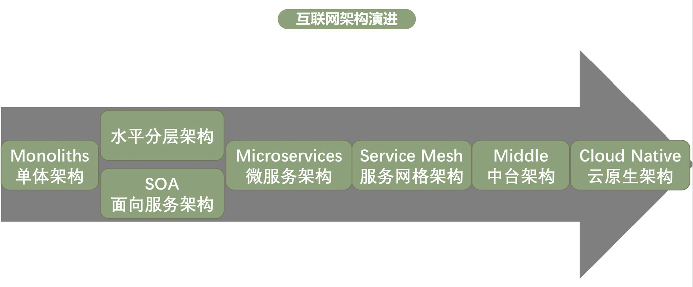
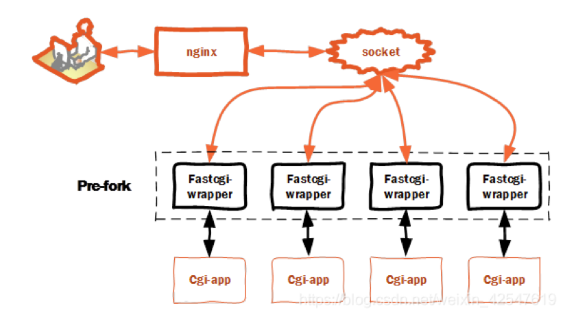

# 第一次分享

## 为什么会做这次分享

[百万架构师课程](https://www.naixuejiaoyu.com/nam.html)

## 课程交付目标

- 提升架构认知高度，升级架构思维方式，提升架构设计能力

  - 千变万化的世界，掌握架构设计本质，以不变应万变

  

## 真正的架构是什么

> **对场景抽象后得出的支撑骨架**
>
> ​		业务负责度 / 数据规模大小 / 人员技术研发能力 / 时间成本 / 运维成本 。。。
>
> **"最适合"架构都是各方面折中（Balance）的结果**
>
> ​		<u>降本增效</u>
>
> **一切脱离场景谈架构都是耍流氓**
>
> **场景驱动架构不断演进**

## 互联网三高架构演进之道--**拆**




- 微服务架构不是银弹
  - 业务关注服务间“通信” --- 业务迭代速度变慢
  - 基础设施组件升级困难 --- 影响基础设施团队的交付能力和速度
  - 多编程语言之间 “通信” 问题 -- 业务每种语言一套基础设施，成本大


- service mesh独立进程、独立升级

- 业务团队专注于业务逻辑本身

- 一套基础设施支持多语言开发

- 业务团队和基础设施团队物理解耦

- 服务治理和服务本身的物理剥离

  

> 公司已经在推进service mesh，可能大家好多人还没接触过微服务架构，所以这次给大家分享下大部分人比较感兴趣的go微服务框架是怎么回事

## go微服务框架设计

### 我们所熟悉的php

Client–(http协议)–nginx–(fastcgi协议)–>fastcgi服务器–（MySQL协议）–mysql



##### pingpong

请求发送完毕后，需要阻塞等待响应。一个请求的响应处理完才能发送下一个请求。典型的比如：

- http

- redis

- mysql

  

##### http协议--请求响应


### rpcx框架

[github地址](https://github.com/smallnest/rpcx)

[文档地址](https://doc.rpcx.io/)

##### 大概的处理过程


##### 协议设计

rpcx 的 请求(request)和响应(response)使用相同的数据结构。

一个消息由下面的项组成:

1. Header: 4 字节
2. Message ID: 8 字节
3. total size: 4 字节, 不包含header和它本身, uint32类型
4. servicePath值的长度: 4 字节, uint32类型
5. servicePath的值: UTF-8 字符串
6. serviceMethod值的长度: 4 字节, uint32类型
7. serviceMethod的值: UTF-8 字符串
8. metadata的大小: 4 字节, uint32类型
9. metadata: 格式: `size` `key1 string` `size` `value1 string`, 可以包含多个
10. playload的大小: 4 字节, uint32类型
11. playload的值: slice of byte ，请求时是请求参数数据，返回时是返回信息数据


```go
// Message is the generic type of Request and Response.
type Message struct {
	*Header
	ServicePath   string
	ServiceMethod string
	Metadata      map[string]string
	Payload       []byte
	data          []byte
}
// Header is the first part of Message and has fixed size.
type Header [12]byte

// EncodeSlicePointer encodes messages as a byte slice poiter we we can use pool to improve.
func (m Message) EncodeSlicePointer() *[]byte {
	meta := encodeMetadata(m.Metadata)

	spL := len(m.ServicePath)
	smL := len(m.ServiceMethod)

	var err error
	payload := m.Payload
	if m.CompressType() != None {
		compressor := Compressors[m.CompressType()]
		if compressor == nil {
			m.SetCompressType(None)
		} else {
			payload, err = compressor.Zip(m.Payload)
			if err != nil {
				m.SetCompressType(None)
				payload = m.Payload
			}
		}
	}

	totalL := (4 + spL) + (4 + smL) + (4 + len(meta)) + (4 + len(payload))

	// header + dataLen + spLen + sp + smLen + sm + metaL + meta + payloadLen + payload
	metaStart := 12 + 4 + (4 + spL) + (4 + smL)

	payLoadStart := metaStart + (4 + len(meta))
	l := 12 + 4 + totalL

	data := bufferPool.Get(l)
	copy(*data, m.Header[:])

	//totalLen
	binary.BigEndian.PutUint32((*data)[12:16], uint32(totalL))

	binary.BigEndian.PutUint32((*data)[16:20], uint32(spL))
	copy((*data)[20:20+spL], util.StringToSliceByte(m.ServicePath))

	binary.BigEndian.PutUint32((*data)[20+spL:24+spL], uint32(smL))
	copy((*data)[24+spL:metaStart], util.StringToSliceByte(m.ServiceMethod))

	binary.BigEndian.PutUint32((*data)[metaStart:metaStart+4], uint32(len(meta)))
	copy((*data)[metaStart+4:], meta)

	binary.BigEndian.PutUint32((*data)[payLoadStart:payLoadStart+4], uint32(len(payload)))
	copy((*data)[payLoadStart+4:], payload)

	return data
}
```

##### multiplex

向连接发送请求完毕后，不用等待响应就可以继续发送请求。


对于客户端来说，比以前复杂了，请求和响应处理不是顺序流程，所以一般会有一个 map 来记录请求和响应的关系

响应解析完毕后，用 seq id 去 map 里找到对应的 request 并唤醒相应的 client。

这种响应模型在 Go 里还是比较容易想到怎么做的，我们只要在 请求 对象里放一个 channel 就行了

##### server端设计

使用

```go
s := server.NewServer()
//s.RegisterName("Arith", new(example.Arith), "")
s.Register(new(example.Arith), "")
s.Serve("tcp", *addr)
```

实现：

```go
// Server is rpcx server that use TCP or UDP.
type Server struct {
	...
	serviceMap   map[string]*service //注册服务map
  ...
}

type service struct {
	name     string                   // name of service
	rcvr     reflect.Value            // receiver of methods for the service
	typ      reflect.Type             // type of the receiver
	method   map[string]*methodType   // registered methods
	function map[string]*functionType // registered functions
}

type methodType struct {
	sync.Mutex // protects counters
	method     reflect.Method
	ArgType    reflect.Type
	ReplyType  reflect.Type
}

//将结构体的方法名字注册到map 反射机制就是在运行时动态的调用对象的方法和属性
func (s *Server) register(rcvr interface{}, name string, useName bool) (string, error) {
	s.serviceMapMu.Lock()
	defer s.serviceMapMu.Unlock()
	if s.serviceMap == nil {
		s.serviceMap = make(map[string]*service)
	}
	service := new(service)
	service.typ = reflect.TypeOf(rcvr)
	service.rcvr = reflect.ValueOf(rcvr)
	sname := reflect.Indirect(service.rcvr).Type().Name() // Type
	if useName {
		sname = name
	}
	service.name = sname
	// Install the methods
	service.method = suitableMethods(service.typ, true)
	s.serviceMap[service.name] = service
	return sname, nil
}

// suitableMethods returns suitable Rpc methods of typ, it will report
// error using log if reportErr is true.
//获取结构体下每个方法名、每个参数的类型
func suitableMethods(typ reflect.Type, reportErr bool) map[string]*methodType {
	methods := make(map[string]*methodType)
	for m := 0; m < typ.NumMethod(); m++ {
		method := typ.Method(m)
		mtype := method.Type
		mname := method.Name
		// First arg must be context.Context
    ctxType := mtype.In(1)
    // Second arg need not be a pointer.
    argType := mtype.In(2)
    // Third arg must be a pointer.
		replyType := mtype.In(3)
		methods[mname] = &methodType{method: method, ArgType: argType, ReplyType: replyType}
		argsReplyPools.Init(argType)
		argsReplyPools.Init(replyType)
	}
	return methods
}
```

##### 服务处理

```go
// serveListener accepts incoming connections on the Listener ln,
// creating a new service goroutine for each.
// The service goroutines read requests and then call services to reply to them.
func (s *Server) serveListener(ln net.Listener) error {
  ...
	for {
		conn, e := ln.Accept()
    go s.serveConn(conn)
  }
  ...
}
func (s *Server) serveConn(conn net.Conn) {
	for {
    ...
		ctx := share.WithValue(context.Background(), RemoteConnContextKey, conn)
		req, err := s.readRequest(ctx, r)
    go func() {
			...
			res, err := s.handleRequest(newCtx, req)
      ...
    }
  }
}

func (s *Server) handleRequest(ctx context.Context, req *protocol.Message) (res *protocol.Message, err error) {
	...
  serviceName := req.ServicePath
	methodName := req.ServiceMethod
	service := s.serviceMap[serviceName]
	mtype := service.method[methodName]
	var argv = argsReplyPools.Get(mtype.ArgType)
	replyv := argsReplyPools.Get(mtype.ReplyType)
	argv, err = s.Plugins.DoPreCall(ctx, serviceName, methodName, argv)
	if mtype.ArgType.Kind() != reflect.Ptr {
		err = service.call(ctx, mtype, reflect.ValueOf(argv).Elem(), reflect.ValueOf(replyv))
	} else {
		err = service.call(ctx, mtype, reflect.ValueOf(argv), reflect.ValueOf(replyv))
	}
  ...
	return res, nil
}
```

##### Client端设计

使用

```go
client := &Client{
  option: DefaultOption,
}

err := client.Connect("tcp", addr)
if err != nil {
  t.Fatalf("failed to connect: %v", err)
}
defer client.Close()

args := &Args{
  A: 10,
  B: 20,
}

reply := &Reply{}
err = client.Call(context.Background(), "Arith", "Mul", args, reply)
if err != nil {
  t.Fatalf("failed to call: %v", err)
}
```

cleint定义

```go
// Client represents a RPC client.
type Client struct {
	Conn net.Conn
	seq      uint64
	pending  map[uint64]*Call
}

// Call represents an active RPC.
type Call struct {
	ServicePath   string            // The name of the service and method to call.
	ServiceMethod string            // The name of the service and method to call.
	Metadata      map[string]string //metadata
	ResMetadata   map[string]string
	Args          interface{} // The argument to the function (*struct).
	Reply         interface{} // The reply from the function (*struct).
	Error         error       // After completion, the error status.
	Done          chan *Call  // Strobes when call is complete. 请求后等待该channel通知
	Raw           bool        // raw message or not
}
```

connect处理

```go

// Connect connects the server via specified network. 客户端连接
func (c *Client) Connect(network, address string) error {
	var conn net.Conn
	var err error
  ...
  fn := makeConnMap[network]
  conn, err = fn(c, network, address)
  c.Conn = conn
  //c.w = bufio.NewWriterSize(conn, WriterBuffsize)
  // start reading and writing since connected
  go c.input()
  ...
	return err
}

func (client *Client) input() {
	var err error
	var res = protocol.NewMessage()
	for err == nil {
		err = res.Decode(client.r) //decode返回的数据
		seq := res.Seq()  //获取到对应的seqid
		var call *Call
		isServerMessage := (res.MessageType() == protocol.Request && !res.IsHeartbeat() && res.IsOneway())
		if !isServerMessage {
			client.mutex.Lock()
			call = client.pending[seq] //取出对应的call并删除pending中元素
			delete(client.pending, seq) 
			client.mutex.Unlock()
		}
		switch {
……
		default:
			if call.Raw { //原生文本请求
				call.Metadata, call.Reply, _ = convertRes2Raw(res)
			} else {
				data := res.Payload
				if len(data) > 0 {
					codec := share.Codecs[res.SerializeType()] //对应序列化方法解码
					err = codec.Decode(data, call.Reply)
					if err != nil {
						call.Error = ServiceError(err.Error())
					}
					
				}
				call.ResMetadata = res.Metadata
			}
			call.done() //通知完成处理
		}
		res.Reset()
	}
…….
}
```

call

```go
func (client *Client) call(ctx context.Context, servicePath, serviceMethod string, args interface{}, reply interface{}) error {
	seq := new(uint64)
	ctx = context.WithValue(ctx, seqKey{}, seq)
	Done := client.Go(ctx, servicePath, serviceMethod, args, reply, make(chan *Call, 1)).Done

	var err error
	select {
	case <-ctx.Done(): //cancel by context
		client.mutex.Lock()
		call := client.pending[*seq]
		delete(client.pending, *seq)
		client.mutex.Unlock()
		if call != nil {
			call.Error = ctx.Err()
			call.done()
		}

		return ctx.Err()
	case call := <-Done:
		err = call.Error
		meta := ctx.Value(share.ResMetaDataKey)
		if meta != nil && len(call.ResMetadata) > 0 {
			resMeta := meta.(map[string]string)
			for k, v := range call.ResMetadata {
				resMeta[k] = v
			}
		}
	}

	return err
}

// Go invokes the function asynchronously. It returns the Call structure representing
// the invocation. The done channel will signal when the call is complete by returning
// the same Call object. If done is nil, Go will allocate a new channel.
// If non-nil, done must be buffered or Go will deliberately crash.
func (client *Client) Go(ctx context.Context, servicePath, serviceMethod string, args interface{}, reply interface{}, done chan *Call) *Call {
	call := new(Call)
	call.ServicePath = servicePath
	call.ServiceMethod = serviceMethod
	meta := ctx.Value(share.ReqMetaDataKey)
	if meta != nil { //copy meta in context to meta in requests
		call.Metadata = meta.(map[string]string)
	}

	if _, ok := ctx.(*share.Context); !ok {
		ctx = share.NewContext(ctx)
	}

	// TODO: should implement as plugin
	client.injectOpenTracingSpan(ctx, call)
	client.injectOpenCensusSpan(ctx, call)

	call.Args = args
	call.Reply = reply
	if done == nil {
		done = make(chan *Call, 10) // buffered.
	} else {
		// If caller passes done != nil, it must arrange that
		// done has enough buffer for the number of simultaneous
		// RPCs that will be using that channel. If the channel
		// is totally unbuffered, it's best not to run at all.
		if cap(done) == 0 {
			log.Panic("rpc: done channel is unbuffered")
		}
	}
	call.Done = done
	client.send(ctx, call)
	return call
}
```

send

```go
func (client *Client) send(ctx context.Context, call *Call) {
	// Register this call.
...
	if client.pending == nil {
		client.pending = make(map[uint64]*Call)
	}
	//发送前生成seqid
	seq := client.seq
	client.seq++
	client.pending[seq] = call

	req := protocol.GetPooledMsg()
	req.SetMessageType(protocol.Request)
	req.SetSeq(seq)

  req.SetSerializeType(client.option.SerializeType)
  req.ServicePath = call.ServicePath
  req.ServiceMethod = call.ServiceMethod
  data, err := codec.Encode(call.Args)
  req.Payload = data
	_, err := client.Conn.Write(*data)
...
}
```

##### 更多的处理

- 服务注册发现，zk、consul、etcd。。。。
- client失败模式，failfast、failover、failtry、failbackup
- 客户端负载均衡，random、轮询、一致性hash、权重、地理位置优先、网络质量优先、server端负载情况
- 熔断
- 限流
- 鉴权
- .......

